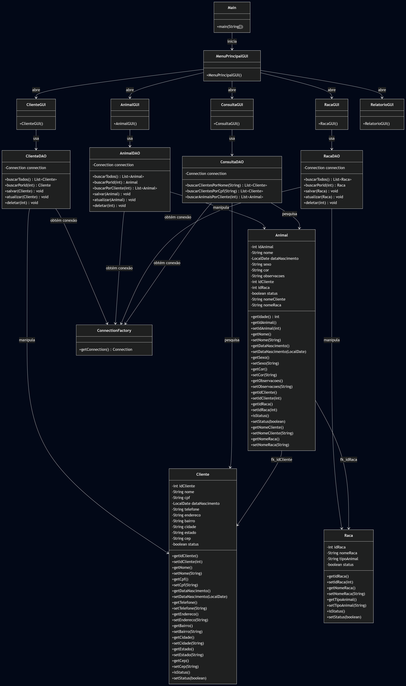
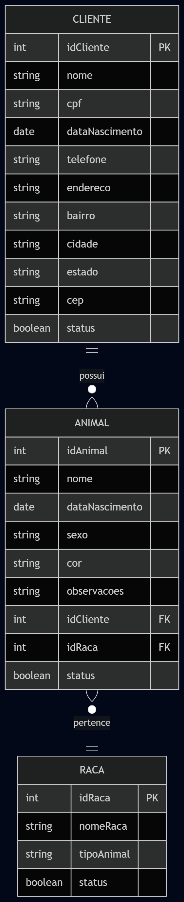
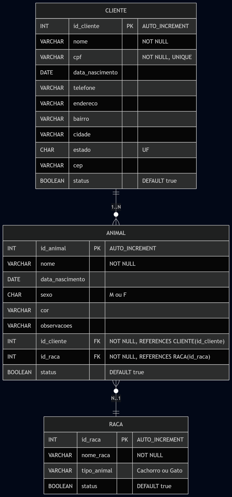
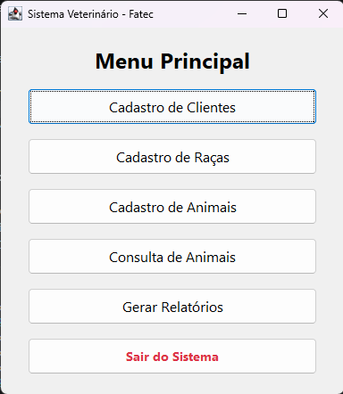
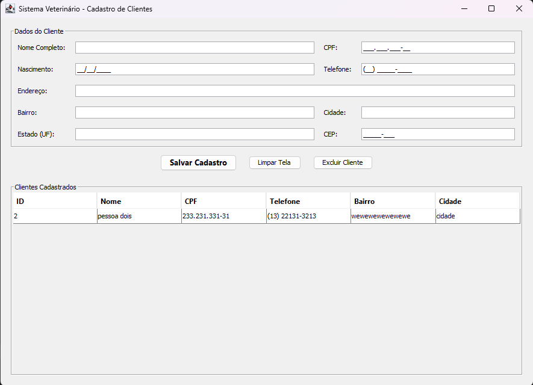
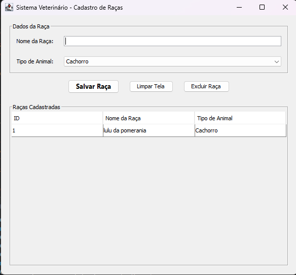
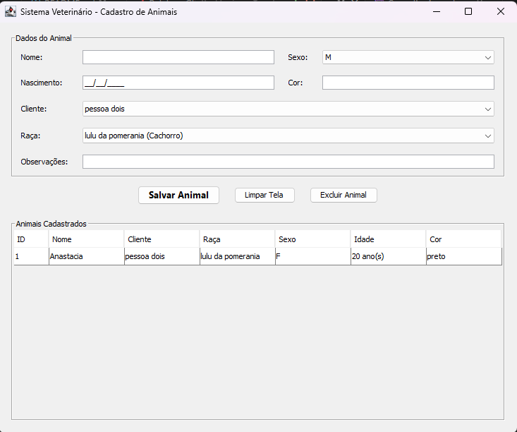
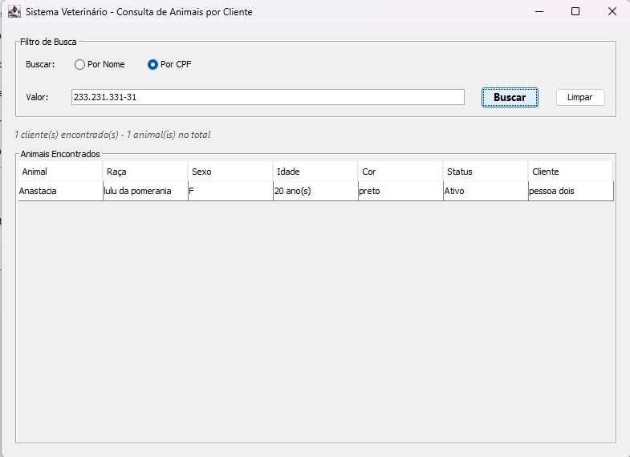
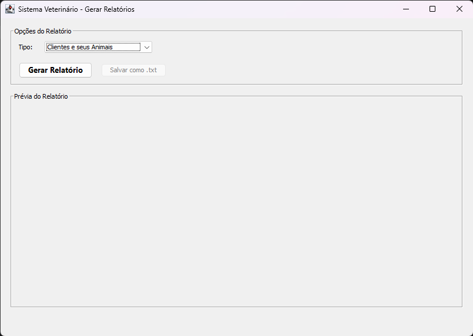

# 🏥 Clínica Veterinária - Sistema de Gestão

Sistema desktop em Java para cadastro de clientes e seus animais (cachorros e gatos), incluindo cadastro de raças, permitindo operações de CRUD e consultas.

## 📋 Funcionalidades

-  Cadastrar, alterar e inativar Clientes (Exclusão Lógica)
-  Cadastrar, alterar e inativar Raças de Animais
-  Cadastrar, alterar e inativar Animais vinculados a um cliente e raça
-  Consultar Animais por Cliente (Pesquisa com filtros por Nome ou CPF)
-  Geração de Relatórios em formato `.txt`:
  - Todos os clientes e seus animais
  - Animais aniversariantes de um mês específico
  - Clientes aniversariantes de um mês específico

## 🛠️ Tecnologias Utilizadas

- **Linguagem:** Java
- **Interface:** Desktop / Swing
- **Banco de Dados:** MySQL utilizando JDBC para conexão e persistência
- **Arquitetura:** Orientação a Objetos (POO) com organização em pacotes (`factory`, `modelo`, `dao`, `gui`)

## 📁 Estrutura do Projeto

```text
/
├── diagramas/                   # Imagens dos diagramas do banco e UML
├── lib/                         # Bibliotecas externas (MySQL JDBC)
├── src/   
│   ├── dao/                     # Data Access Objects para persistência
│   ├── factory/                 # Factory para conexão com MySQL
│   ├── gui/                     # Interfaces gráficas e Main.java
│   └── modelo/                  # Classes de modelo (entidades)
├── telas/                       # Prints das telas para o manual
├── README.md                    # Documentação do projeto
├── relatorio.txt                # Exemplo de saída gerada pelo sistema
└── Script.sql                   # Script de criação do banco de dados
```
## 📊 Diagramas

Abaixo estão os diagramas estruturais e de banco de dados do sistema:

### 1. Diagrama de Classes UML


### 2. Diagrama Conceitual


### 3. Diagrama Lógico


## 🚀 Como Executar

1. Configure o banco de dados MySQL com o arquivo `Script.sql` incluso no projeto para criação das tabelas e inserção inicial.
2. Altere as credenciais de conexão em `src/factory/ConnectionFactory.java` conforme necessário.
3. Compile o projeto garantindo que o driver JDBC do MySQL esteja no classpath.
4. Execute a classe `Main.java` localizada no pacote `gui`.

## 📝 Notas e Regras de Negócio Implementadas

- **Exclusão Lógica**: O sistema não exclui registros fisicamente do banco de dados. A exclusão apenas altera o status para inativo (booleano).
- **Validações de Cliente:** O CPF é único e obrigatório no sistema, e é validado no momento de adição e alteração.
- **Validações de Raça:** Não é permitido cadastrar raças duplicadas para o mesmo tipo de animal (Cachorro/Gato).
- **Idade:** A idade dos animais exibida nas consultas é calculada dinamicamente a partir da data de nascimento.

---

## 📖 Manual do Usuário

Esta seção reúne as instruções de uso e as telas da aplicação.

### Preparação e Inicialização
Certifique-se de executar o `Script.sql` no seu banco MySQL. Após configurar a classe `ConnectionFactory.java` com o seu usuário e senha do banco, execute o arquivo `Main.java` pelo pacote `gui` para iniciar o sistema.

### Principais Telas e Funcionalidades

**1. Menu Principal**
Ponto central de navegação para acessar as telas de Clientes, Animais, Raças, Consultas e Relatórios.
> 

**2. Clientes (`ClienteGUI`)**
- **Cadastrar:** Preencha os dados do cliente. O Nome e CPF são obrigatórios. O sistema validará se o CPF já existe.
- **Alterar/Excluir:** Selecione um cliente da lista para atualizar suas informações. Ao clicar em excluir, o cliente será desativado (exclusão lógica).
> 

**3. Raças (`RacaGUI`)**
- **Cadastrar:** Adicione novas raças informando o nome e selecionando se pertencem a "Cachorro" ou "Gato". 
> 

**4. Animais (`AnimalGUI`)**
- **Cadastrar:** Todo animal registrado deve estar obrigatoriamente ligado a um cliente (dono) e a uma raça previamente cadastrada.
> 

**5. Consultar Animais (`ConsultaGUI`)**
- **Pesquisar:** Utilize esta tela para filtrar animais específicos de um cliente. Você pode pesquisar pelo "Nome do cliente" ou pelo "CPF".
> 

**6. Relatórios (`RelatorioGUI`)**
- **Gerar `.txt`:** Selecione o tipo de relatório desejado e exporte os dados de clientes/animais ou aniversariantes do mês.
> 
